# Machine Learning Modeling in Breast Cancer Prognosis 

## Introduction:
Breast Cancer is the most common cancer maligancy in women around the world and is curable in 70-80% of patients with early detection1.  In the U.S. alone, 12% of women will be diagnosed with breast cancer in their lifetime2 . Its has been estimated to treat each individual could cost in the range of 16,000-100,000 USD13.  The development of gene microarray technologies has allowed the detection of gene expression amoung thousands of genes simultanously.  Technological insights could help patient outcomes as well as save costs in poor diagnosis and ineffective treatments. This technology, in concert with the migration to electronic health records can now be utilitzed to help understand the underlying pathways of various disease states and enhance patient outcomes.

The goal of this study is to create a machine learing model that can identify patients with poor outcomes (death from cancer) from gene expression profiles (GEP).  Additionally, gain insights into genes that influence those predictions.

## Data Source

The [cBioPortal hosted by the Center of Molecular Oncology at Sloan Kettering Cancer Center](https://www.cbioportal.org/datasets) 3 holds an open source website with various datasets in the field of cancer research.  This analysis will focus on the METABRIC Dataset. Due to privacy and HIPAA regulations, information is anonymous and preformatted.

<!-- Beast cancer has previously been classifed based on tumor type (ductal, lobular infiltrating carcinoa, etc), HER2 receptor status, histological grade and others.  Recenlty, with cheaper, faster, and more abundant sequencing technology, the possibility of gene expression profiling (GEP) has loomed as a possible diagnostic tool. __With the complex nature of biological pathways, machine learning and big data could be the tool to elucidate the obscure pathways that have not been discovered. -->

## Exploratory Data Analysis

The Molecular Taxonomy of Breast Cancer International Consortium (METABRIC) is an organization hosting a database  with clinical and genetic data from 1,904 patients and primary breast cancer samples.   A list of 489 genes are listed as feature columns and Z-scores of mRNA expression levels are listed as values from RNA-seq collection. In this study, we will be focusing on the mRNA expression levels which is exclusively numerical. The catagory of patient outcomes (living, death from other causes, and death from cancer) was recatagorized as 1:deceased due to cancer, 0:all other cases.

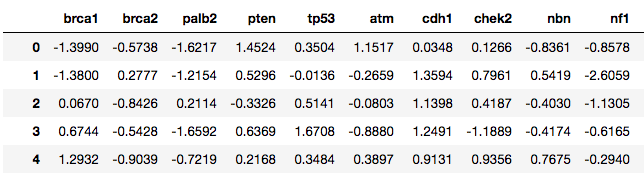

Clinical information such as treatment and age at diagnosis are also features. 

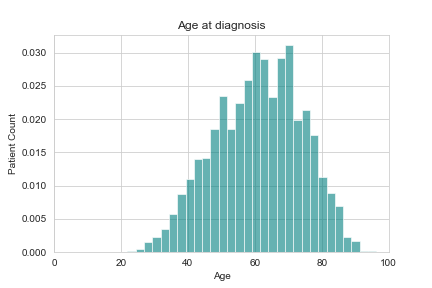

Of the 1,904 patients, 622 were classfied as deceased due to cancer, and as a group had a lower time of survival after diagnosis.

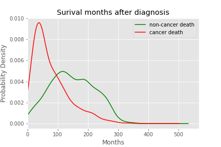

Patients tend to be multi-hit events in both classes (mutiple mutations)

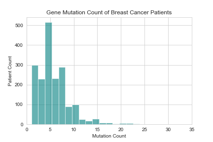

## Modeling 

Baseline Model: Logistic Regressor
    untuned model performs poorly

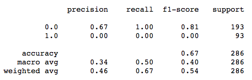

Logistic Regressor model proformance after tuning.

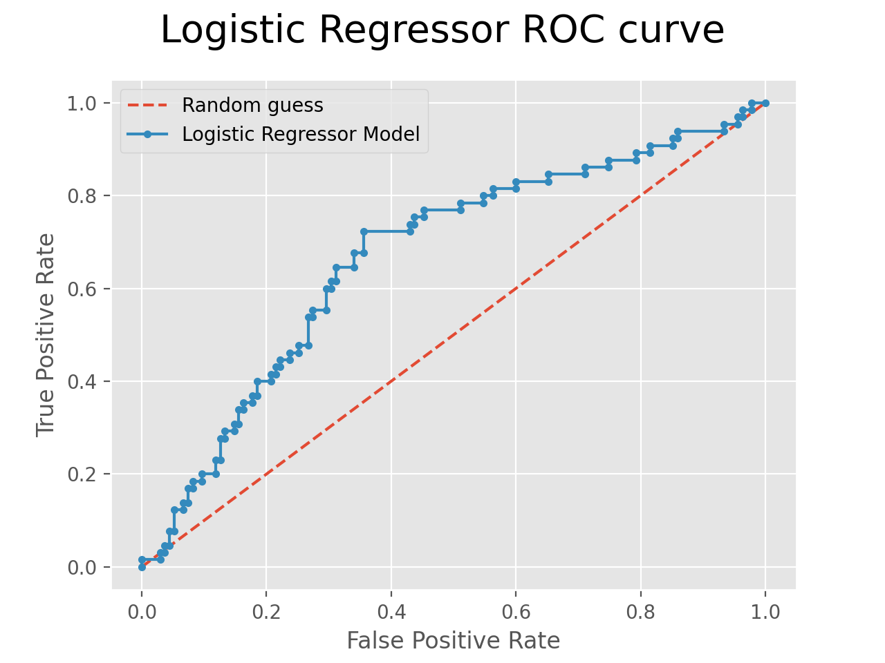

Recall score of 0.66 
Best Parameters for Model: penalty = l1, class weight = 'balanced', C = 0.03077
Best Score for LogisticRegression: 0.6678

### With threshold value lowered to 0.3, recall score climbs to 94%

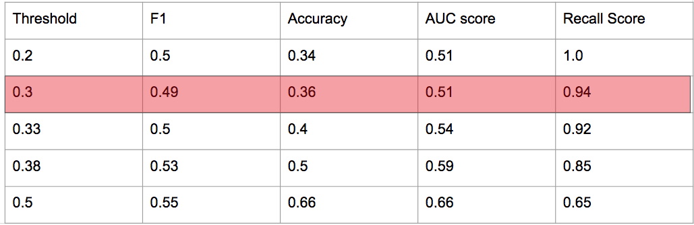

## Gene Coefficients in Lasso regularized Model

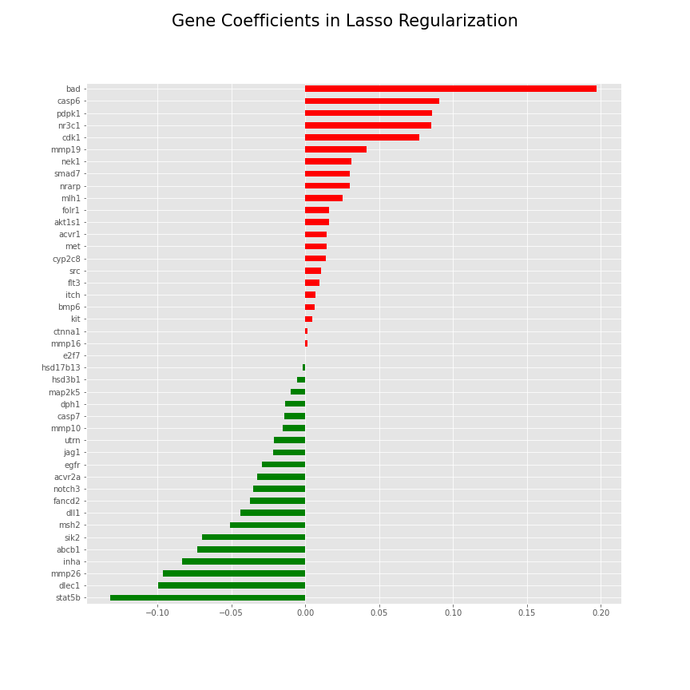

[STAT5](https://pubmed.ncbi.nlm.nih.gov/23161573/) gene could potentially be invovled in a protective pathway according to pubmed [article](https://pubmed.ncbi.nlm.nih.gov/23161573/) would correlate with findings in this study.

* Abnormal STAT5 activity has been shown to be closely connected to a wide range of human cancers,[4] and silencing this aberrant activity is an area of active research in medicinal chemistry.[5]

[BAD](https://www.ncbi.nlm.nih.gov/gene?Db=gene&Cmd=DetailsSearch&Term=572) gene (bcl2) is family of regulators involved in programmed cell death(apoptosis) and has been involved in many studies about cancer and disease states.

## Other Findings

* Feature 120 
 is highest importance in 2nd and 3rd highest recall scoring models. Gradient Boosting and Random Forest

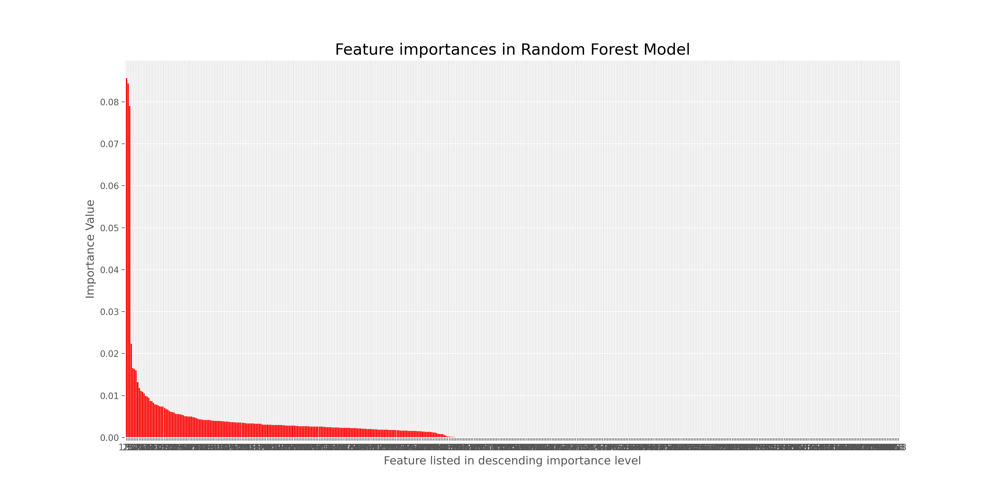

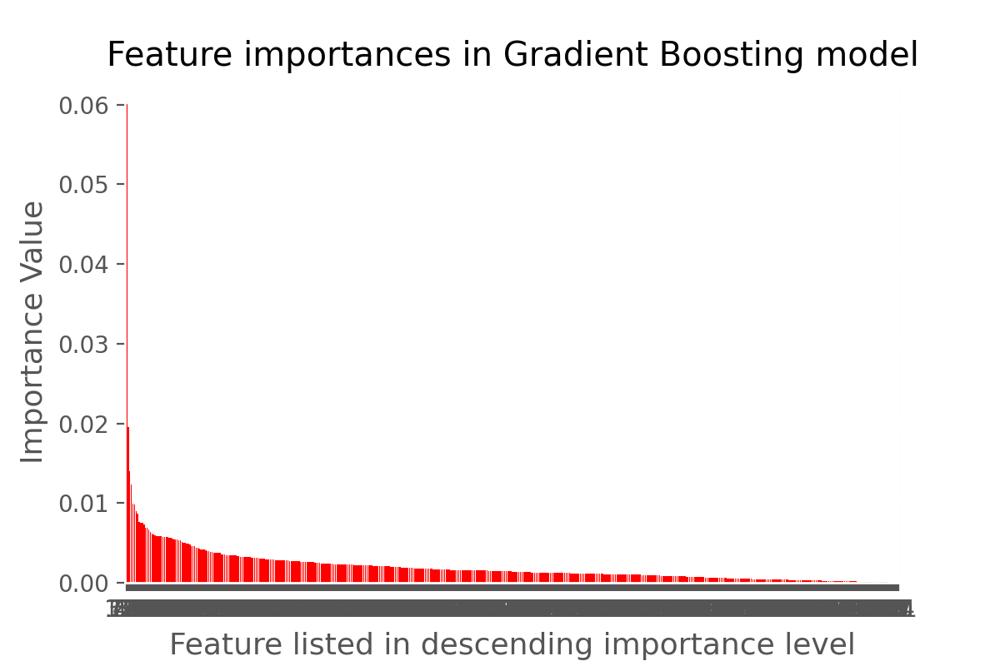

Based on our modeling, this gene is a candidate to maximize the benefit from those individuals with poor prognosis and outlooks.

Synnove et al. published in Oncology Reports an article in 2010 suggesting that AURKA could be a suitbile candidate for target therapies with tradional lab(in-situ hybridization) techniques.  [pub med article](https://pubmed.ncbi.nlm.nih.gov/20043089/#:~:text=AURKA%20gene%20amplification%20is%20a,therapies%20with%20Aurora%2DA%20inhibitors.)  

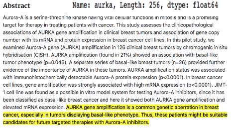

## Future Directions :

* Unsupervised gene clustering
* Incorporate clinical data
* Research Genes of interest

As expected, more data would help increase the prediction of the mRNA model, but also, finding a way to incorporate the clinical and gene specific mutation data to increase model accuracy/recall scores would be a potential future goal.  Potentially, using this general model to use on other disease states would be another future project and creating a pipeline to pymol and autodock software. Another avenue to pursue would be to create an app that would allow a user to input their clinical data, once the clinical data has been incoporated for a model prediction and prognosis of their condition.

## Acknowledgements
* DSI Denver staff/cohort
* Kayla Thomas
* Chris Reger
* Jess Curley
* Ian Hettrich
* Travis Koenigsknecht
* Scrum Group 4 and the whole of Denver DSI

## Sources

1 [Nature](https://www.nature.com/articles/s41572-019-0111-2)  

2 [JAMA](https://jamanetwork.com/journals/jama/article-abstract/2721183)  

3 [meta bric website](https://www.cbioportal.org/study/summary?id=brca_metabric) 

4 [stats5](https://erc.bioscientifica.com/view/journals/erc/15/2/367.xml)

5 [stat52](https://www.ncbi.nlm.nih.gov/pmc/articles/PMC3233979/)

6 [scikit-learn](https://scikit-learn.org/)

7 [life-lines-install](https://lifelines.readthedocs.io/en/latest/fitters/univariate/KaplanMeierFitter.html?highlight=KaplanMeierFitter)

8 [wikipedia](https://en.wikipedia.org/wiki/Aurora_A_kinase)

9 [kaggle](https://www.kaggle.com/raghadalharbi/breast-cancer-gene-expression-profiles-metabric)

10 [stack_overflow](https://stackoverflow.com/)

11 [machine-mastert](https://machinelearningmastery.com)

12 [medium_banner](https://medium.com/berkeleyischool/breast-cancer-genetic-testing-and-privacy-476b799e5f86)

13 [cnbc]https://www.cnbc.com/2020/10/22/how-much-breast-cancer-treatment-costs-even-with-health-insurance-.html#:~:text=More%20than%20275%2C000%20women%20in,anywhere%20between%20%2420%2C000%20and%20%24100%2C000.

<!-- 

# capstone2

## Introduction:
Breast Cancer is the most common cancer maligancy in women around the world and is curable in 70-80% of patients with early detection.  In the U.S. alone, roughly 2.1 million individuals are affected.  The development of gene microarray technologies has allowed the detection of gene expression amoung thousands of genes simultanously.  Technological insights could help patient outcomes as well as save costs in non-effective treatments. This technology in concert with the migration to electronic health records can now be utilitzed to help understand the underlying pathways and outcomes of various disease states and patient outcomes. -->

<!-- Beast cancer has previously been classifed based on tumor type (ductal, lobular infiltrating carcinoa, etc), HER2 receptor status, histological grade and others.  Recenlty, with cheaper, faster, and more abundant sequencing technology, the possibility of gene expression profiling (GEP) has loomed as a possible diagnostic tool. __With the complex nature of biological pathways, machine learning and big data could be the tool to elucidate the obscure pathways that have not been discovered. -->

<!-- *in silica solutions faster and more effective that laboratory processing
*could save costs of treatment if high risk individuals are identified early and a proactive treament plan can be made.
*breast cancer data could provide insights into other forms of cancer

In this study we will be trying to find gene expression profiles in patients with poor outcomes (death by cancer) 

## Exploratory Data Analysis

The Molecular Taxonomy of Breast Cancer International Consortium (METABRIC) is an organization hosting a database  with clinical and genetic data from 1,904 primary breast cancer samples.  Genes are listed as feature columns and Z-scores of mRNA expression levels are listed as values. In this study, we will be focusing on the mRNA expression levels

Clinical information such as treatment and age at diagnosis are also features. 

Of the 1,904 patients, 622 were classfied as deceased due to cancer. and as a group had a lower time of survival after diagnosis.

Also noteworthy, these tend to be multi-hit events ie mutiple mutations

Surival of all 1,904 patients

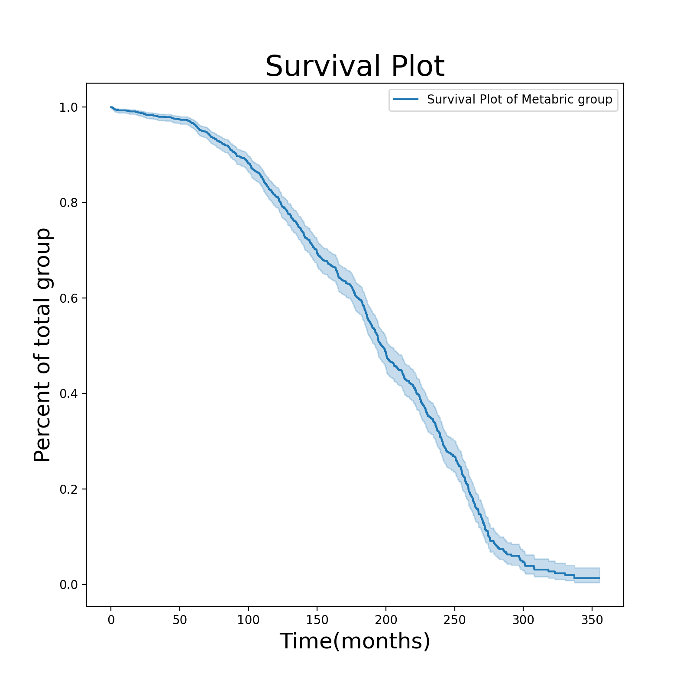 -->

