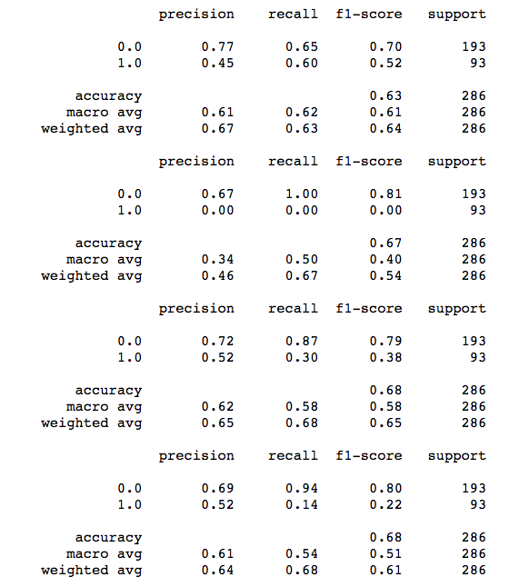
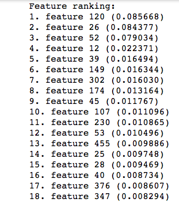
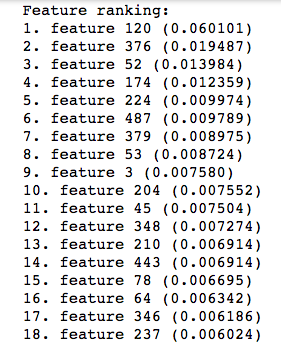

# capstone2

## Introduction:
Breast Cancer is the most common cancer maligancy in women around the world and is curable in 70-80% of patients with early detection.  In the U.S. alone, roughly 2.1 million individuals are affected.  The development of gene microarray technologies has allowed the detection of gene expression amoung thousands of genes simultanously.  Technological insights could help patient outcomes as well as save costs in non-effective treatments. This technology in concert with the migration to electronic health records can now be utilitzed to help understand the underlying pathways and outcomes of various disease states and patient outcomes.

<!-- Beast cancer has previously been classifed based on tumor type (ductal, lobular infiltrating carcinoa, etc), HER2 receptor status, histological grade and others.  Recenlty, with cheaper, faster, and more abundant sequencing technology, the possibility of gene expression profiling (GEP) has loomed as a possible diagnostic tool. __With the complex nature of biological pathways, machine learning and big data could be the tool to elucidate the obscure pathways that have not been discovered. -->

*in silica solutions faster and more effective that laboratory processing
*could save costs of treatment if high risk individuals are identified early and a proactive treament plan can be made.
*breast cancer data could provide insights into other forms of cancer

In this study we will be trying to find gene expression profiles in patients with poor outcomes (death by cancer) 

## Exploratory Data Analysis

The Molecular Taxonomy of Breast Cancer International Consortium (METABRIC) is an organization hosting a database  with clinical and genetic data from 1,904 primary breast cancer samples.  Genes are listed as feature columns and Z-scores of mRNA expression levels are listed as values. In this study, we will be focusing on the mRNA expression levels

Clinical information such as treatment and age at diagnosis are also features. 

Of the 1,904 patients, 622 were classfied as deceased due to cancer. and as a group had a lower time of survival after diagnosis.

Also noteworthy, these tend to be multi-hit events ie mutiple mutations

Surival of all 1,904 patients

##Feature 120 
Feature 120 is highest importance in 2 highest recall scoring models. Gradient Boosting and Random Forest

Based on our modeling, this gene is a strong candidate to maximize the benefit from those individuals with poor prognosis and outlooks.

